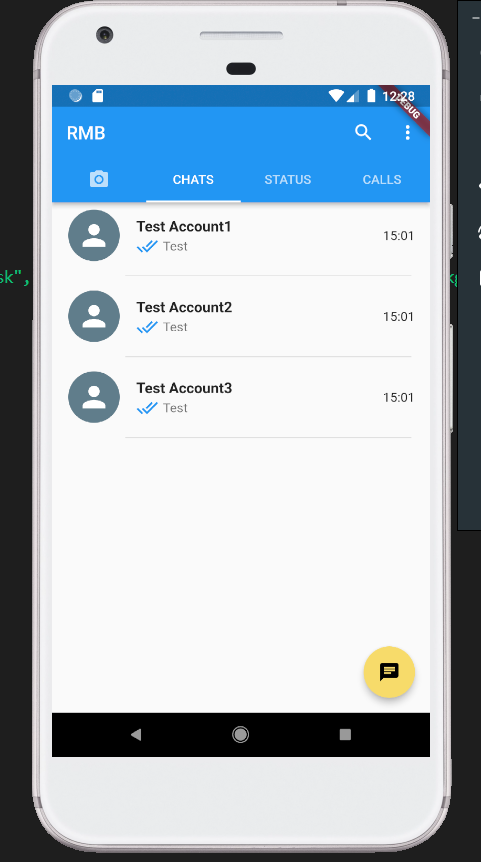

# rmb

A new Flutter project.

# Languages

## Getting Started

1. Download Backend server and setup [Repo](https://github.com/RanushMithila/flutterChatAppServer)
2. Download This Repo
3. setup android emulator and run

### My emulator

### App interface

### Message Sending

